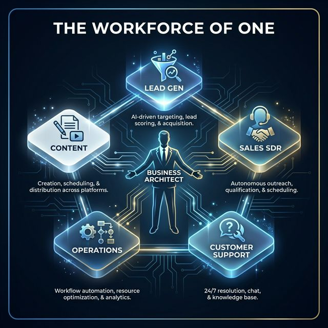

# Preface: The End of the Hiring Treadmill

The traditional business model is broken.

For decades, conventional wisdom said you need to hire to grow. Scale means building a team. Success requires managing people.

Here's the thing - people are expensive. They need management, benefits, training. And they're human: they make mistakes, get tired, quit.

Then came "No-Code" automation. Zapier and Make promised to replace employees with simple "If This Then That" logic. But anyone who's actually built this stuff knows the truth: it's fragile as hell. One API change, one malformed email, one weird date format, and your entire "automation" collapses into error notifications.

**This book is about the third way.**

It’s about the leap from fragile automation to resilient, **Self-Healing Agentic Workflows**.

We're living in a moment where enterprise-grade intelligence costs nothing. Using the **Google Antigravity IDE** with models like Claude and Gemini, you can build systems that don't just run tasks—they manage outcomes.

They think. They reason. They see. And when they break (they will), they fix themselves.

This is the **Workforce of One**.

It's a single person commanding a fleet of specialized AI agents that process leads, manage support, rewrite content, and monitor data - with the oversight of a high-performance HR department but zero payroll.

In these pages, I'll show you how to stop being an "Operator" who does the work and become an "Architect" who designs the system.

You won't just learn how to use AI. You'll learn how to build an employee that never sleeps, never asks for a raise, and gets smarter every time it screws up.

This is the story of your last employee.

---

**Travis Steel**
*February 2026*
